# Securing CI/CD Pipelines with OpenID Connect (OIDC) in AWS IAM

*GitHub Repository - *https://github.com/ucheor/OIDC_setup_QR.git*

Securing your CI/CD pipelines should not be optional — it is essential. Long-lived AWS access keys are risky: if they leak, they can compromise your entire cloud environment. The gold standard solution? OpenID Connect (OIDC) with AWS IAM, which enables your pipeline to assume roles dynamically, without storing static credentials.

**Why OIDC Matters for CI/CD**

CI/CD platforms like GitHub Actions need credentials to connect to your AWS account. Traditionally, this was done with IAM users and access keys—long-lived secrets stored in environment variables. This approach has two major risks:

Key leakage – hard-coded or misconfigured keys can be exposed.

Key rotation overhead – keeping secrets up to date adds operational burden.

With OIDC, your pipeline requests temporary credentials from AWS via a trusted identity provider (e.g., GitHub or GitLab). The credentials expire automatically, and no secrets are stored in your repo or CI environment. Here’s a practical, step-by-step guide to set it up.

---

**Step-by-Step: Setting up OIDC in AWS IAM**

**Step 1:** Configure an OIDC Identity Provider in AWS

Go to AWS IAM → Identity providers → Add provider.

---

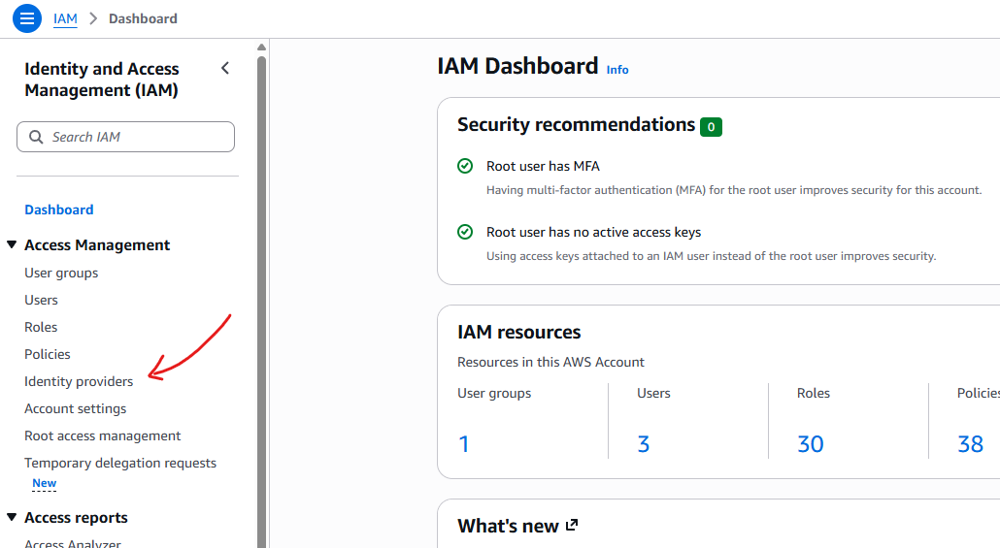

---

Choose Provider Type: OpenID Connect.

Enter the Provider URL for your CI platform:

GitHub Actions: https://token.actions.githubusercontent.com

GitLab CI: https://gitlab.com

Enter the Audience, typically sts.amazonaws.com.

This establishes a trust relationship between AWS and your CI provider.

---


---

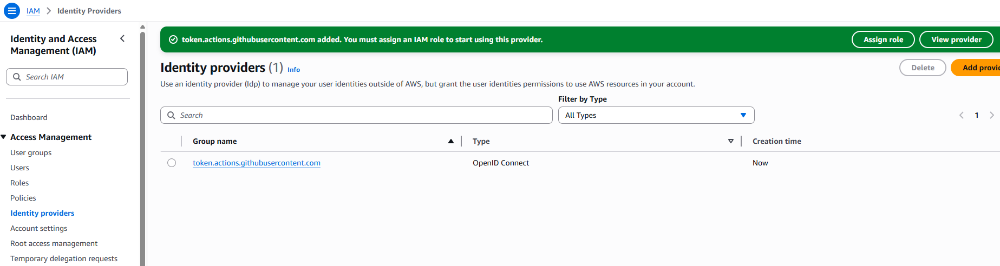

---

**Step 2:** Create an IAM Role for Your Pipeline

While on AWS IAM → Roles → Create Role.

---

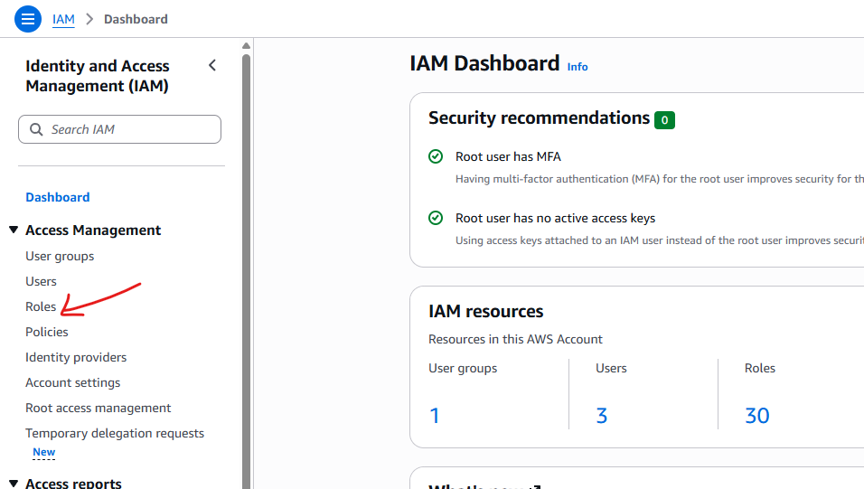

---

Choose Web identity as the trusted entity type. Select the OIDC identity provider you created. From the dropdown, selete "sts.amazon.aws.com as the Audience. In our example using GitHub as our repository, you will need to provide the GitHub organization name. Setting up the repository name and branch name while optional, offers more control and makes it easier to trace and audit access to your AWS account. 

---

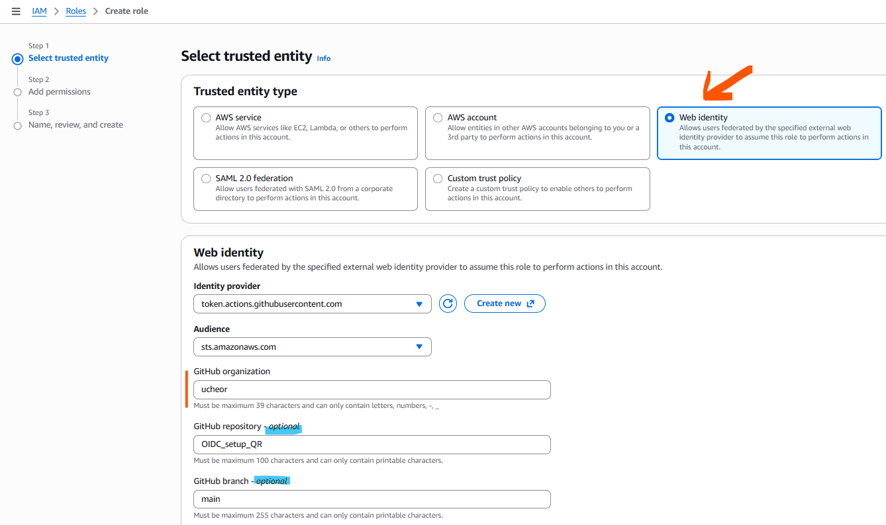

---

Attach permission policies to your role. In this example, we will give a **AmazonS3ReadOnlyAccess** permission to enable us deploy a workflow from GitHub and view a list of our S3 buckets using OIDC. 

---

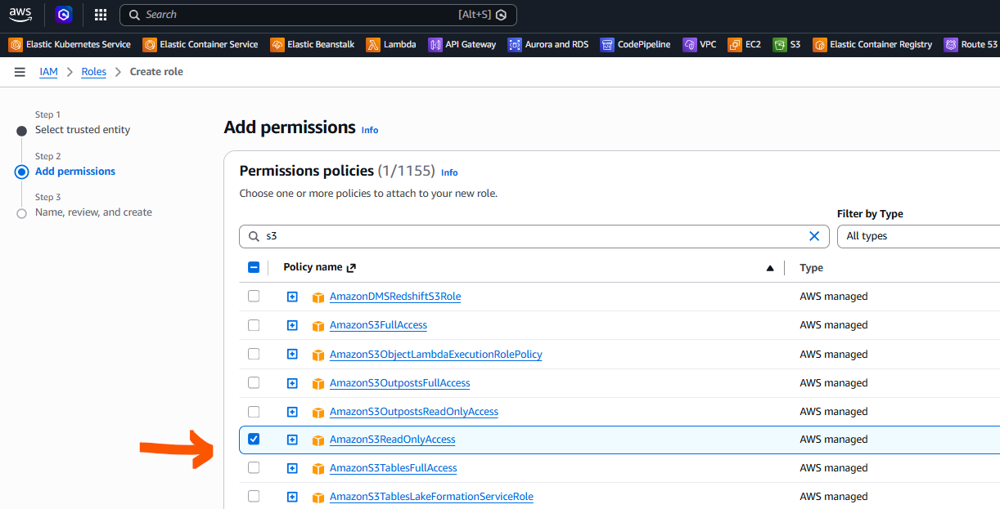

---

Click Next to name and review our selected trusted entities and permissions policy summary for the role. Remember to add a description explanating the purpose of the role. 

---

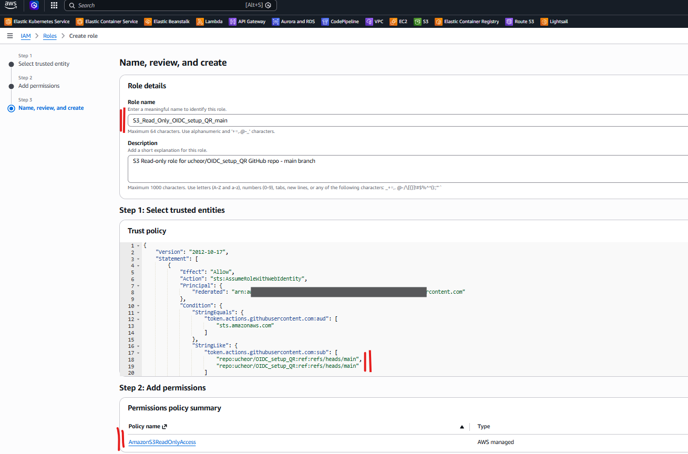

---

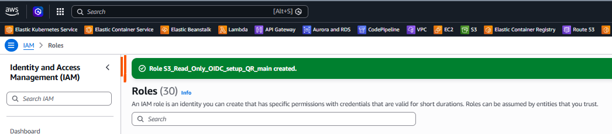

---

**Step 3:** Update Your CI/CD Pipeline Files, Secrets and Variables

We will be using the yaml file below for our GitHub Action pipeline. You can also access it in the GitHub repository: **https://github.com/ucheor/OIDC_setup_QR.git**

```
mkdir -p .github/workflows
touch .github/workflows/s3.yaml
```
Add the yaml below to the s3.yaml file

```
name: OIDC AWS S3 Test

on:
  workflow_dispatch:
  push:
    branches:
      - main

permissions:
  id-token: write
  contents: read

jobs:
  list-s3:
    runs-on: ubuntu-latest

    steps:
      - name: Checkout repository
        uses: actions/checkout@v4

      - name: Configure AWS credentials using OIDC
        uses: aws-actions/configure-aws-credentials@v4
        with:
          role-to-assume: ${{ secrets.AWS_ROLE_TO_ASSUME }}
          role-session-name: OIDC_check_S3-${{ github.run_number }}
          aws-region: ${{ vars.AWS_REGION }}

      - name: Verify identity
        run: aws sts get-caller-identity

      - name: List S3 buckets
        run: aws s3 ls
```

---

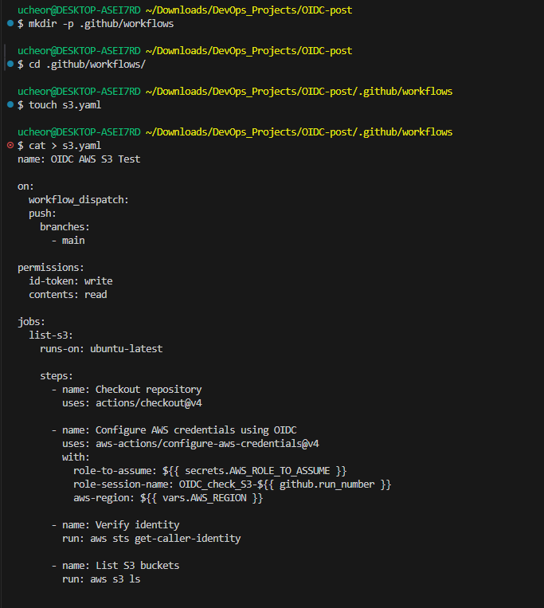

---

Secrets are encrypted values accessible only to GitHub Actions workflows. They are ideal for sensitive credentials. Go to your GitHub repository → Settings → Secrets and variables → Actions → New repository secret. Set up a secret for AWS_ROLE_TO_ASSUME and add the arn for the role we set up earlier on AWS IAM. Using secrets helps avoid hardcoding secrets or credentials in workflow YAML files. This way, we can combine secrets with OIDC for maximum security — your pipeline can assume AWS roles without ever storing keys.

---

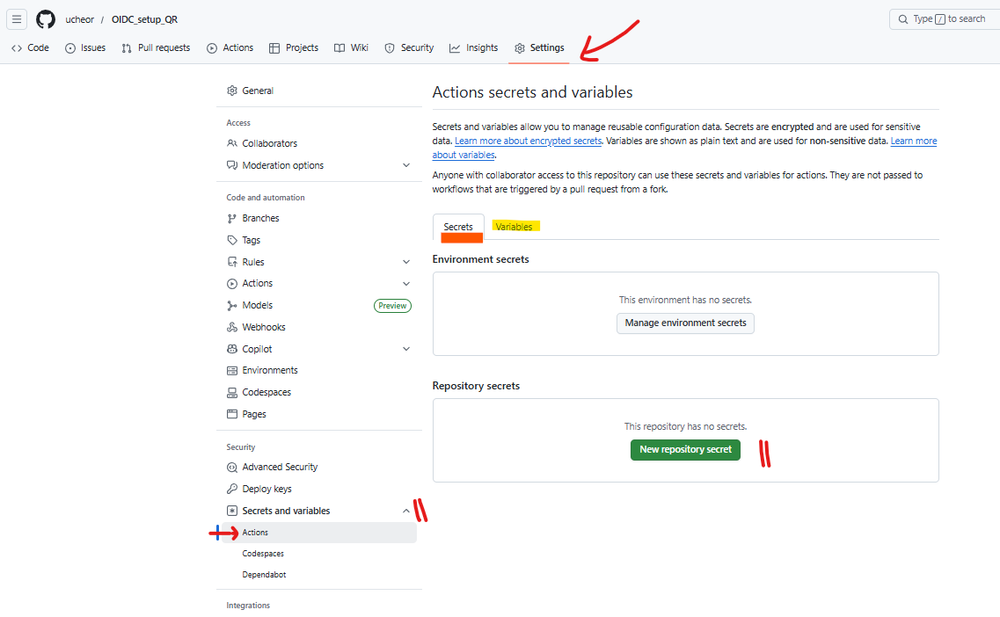

---

Variables store non-sensitive configuration values that you might want to reference in multiple workflows, such as environment names, region names, or feature flags. Go ahead and do the same for the variable and set up your AWS_REGION as a variable. 

---

**Step 4:** Test & Audit

Trigger your pipeline and verify the role is assumed. We should be able to view all S3 buckets in the region specified. If you do not have an existing bucket, you can of course create one and watch the GitHub Action pipeline console to see it listed if everything is set up correctly. Make sure no static keys are stored in your CI/CD environment.

---

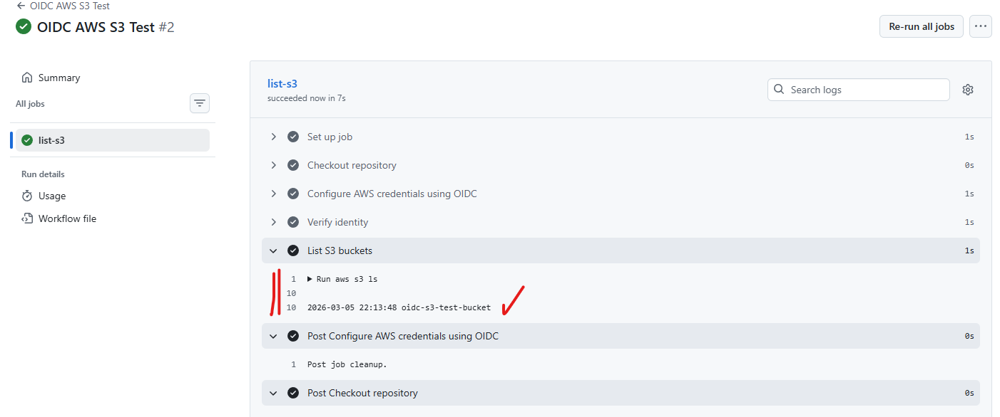

---

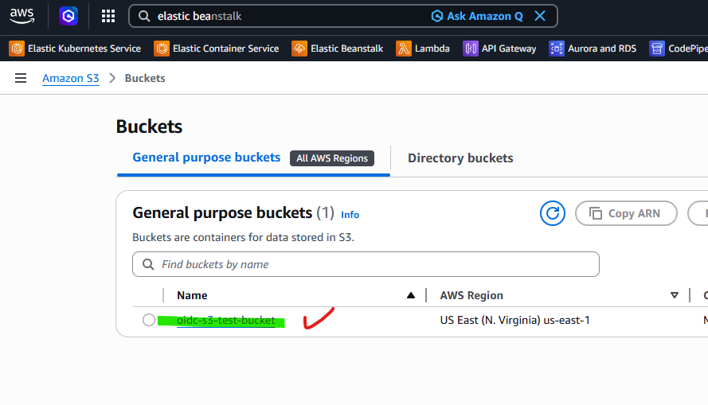

---

**Key Benefits:**

- No static secrets: credentials are temporary and automatically expire.

- Fine-grained access: roles can be scoped per repository, branch, or workflow.

- Audit-friendly: all access is logged in CloudTrail.

- Reduced risk: even if your CI system is compromised, attackers cannot use long-lived keys.

**Bottom line:** Using OIDC with AWS IAM is a safe way to authenticate your CI/CD pipelines. It eliminates risky secrets, provides temporary credentials on-demand, and ensures you follow security best practices for cloud deployments.

---

*Let me know if you have any questions or insights! Feel free to connect!*